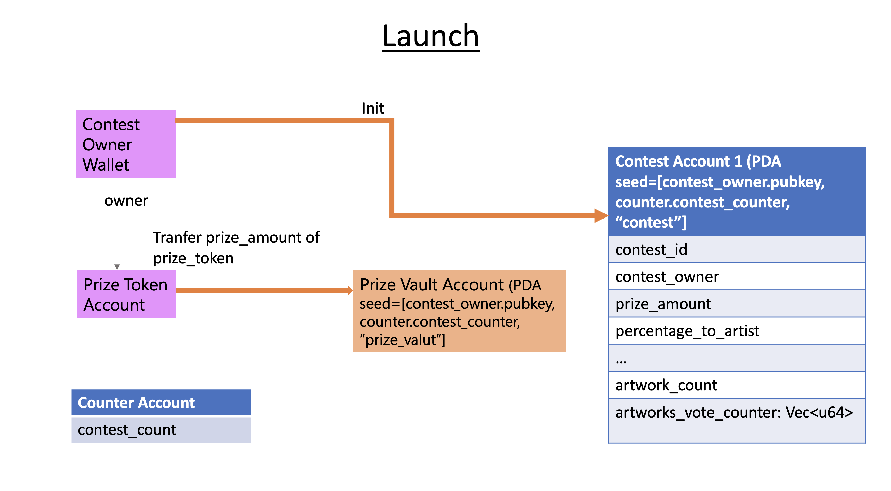
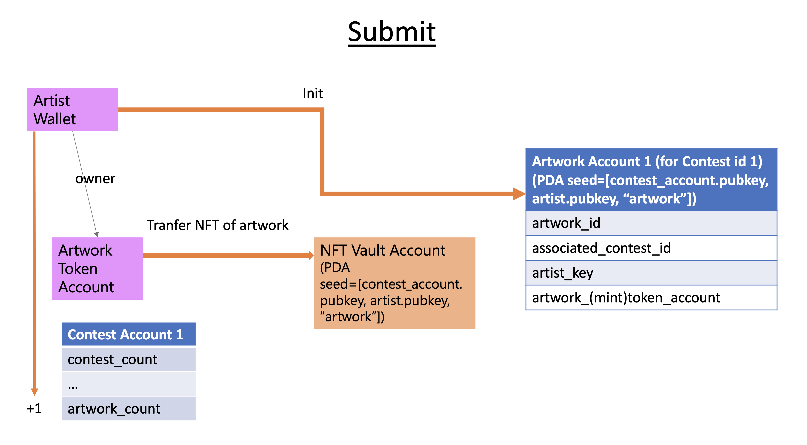
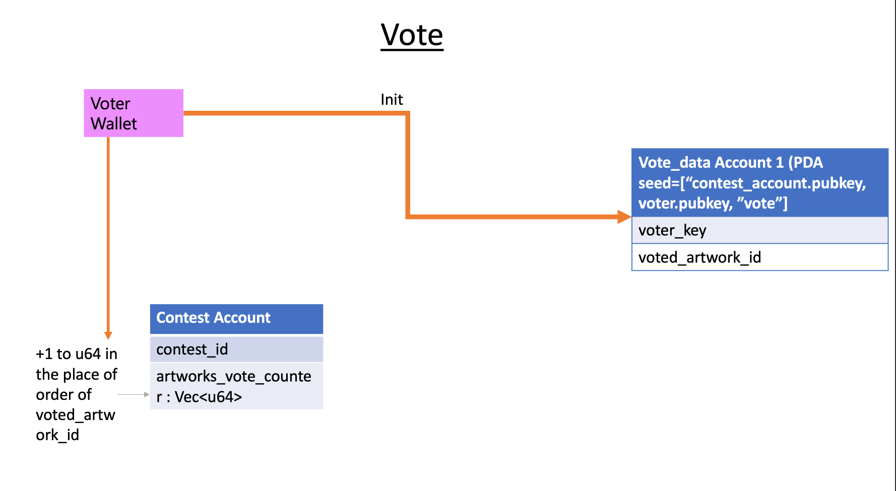

# Contract for NFTthon - NFT Contests for Artists and Fans, powered by Solana
## Chart of each primary function

<br>

<br>


## Test

### 1. Clone repo  

### 2. Add the path of your `wallet` in the `[provider]` section in Anchor.toml file, and execute the command below.
```
yarn
anchor test
```
<br>
The test is expected to work like below.
<br>

<br>

📫 How to reach us: :call_me_hand: <br>
&nbsp;&nbsp;&nbsp;&nbsp;&nbsp;&nbsp;&nbsp;&nbsp;&nbsp;&nbsp; [Email](nfthon@gmail.com)
&nbsp;&nbsp;&nbsp;&nbsp;&nbsp;&nbsp;&nbsp;&nbsp;&nbsp;&nbsp; [Twitter](https://www.twitter.com/nftthon) 

#### Made with :heart: in Sg :singapore:

### Open Source
This repo (NFTthon contract) is licensed under Apache 2.0.

Unless you explicitly state otherwise, any contribution intentionally submitted for inclusion in this repo by you, as defined in the Apache-2.0 license, shall be licensed as above, without any additional terms or conditions. 
